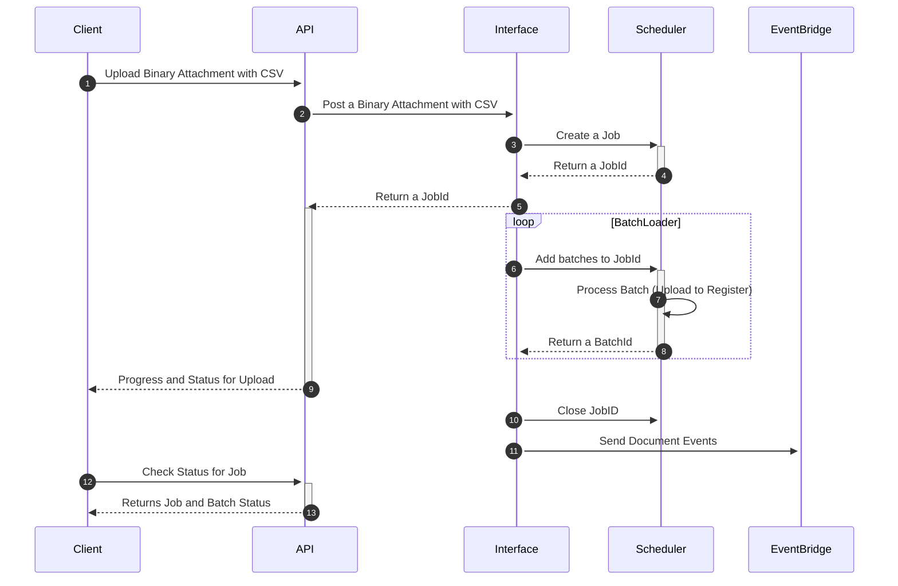

# Scanned Batch Upload

Overview

```mermaid
sequenceDiagram
    autonumber
    Client->>+API: Upload Binary Attachment with CSV
    API->>+Interface: Post a Binary Attachment with CSV
    Interface->>+Scheduler: Create a Job
    Scheduler-->>-Interface: Return a JobId
    Interface-->>+API: Return a JobId
    loop BatchLoader
        Interface->>+Scheduler: Add batches to JobId
        Scheduler->>Scheduler: Process Batch (Upload to Register)
        Scheduler-->>-Interface: Return a BatchId
    end
    API-->>-Client: Progress and Status for Upload
    Interface->>+Scheduler: Close JobID
    Interface->>+EventBridge: Send Document Events
    Client->>+API: Check Status for Job
    API-->>-Client: Returns Job and Batch Status
```